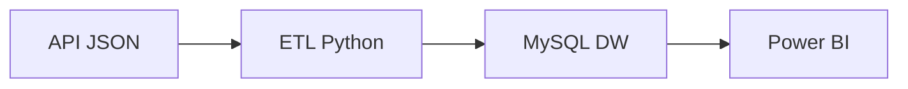

# projeto_feminicídio
Pipeline de dados sobre feminicídio com Python, MySQL e Power BI

# 🔴 Projeto de Dados: Feminicídio em Dados

<p align="center">
  
  
  
  
  
</p>

---

## 📊 Visão Geral

Este projeto foi desenvolvido com o objetivo de construir um pipeline completo de dados para análise de feminicídio, transformando dados públicos em insights estratégicos para apoio à tomada de decisão.

---

## 🎯 Objetivo

✔ Criar pipeline end-to-end
✔ Estruturar dados em modelo dimensional
✔ Disponibilizar dados para BI
✔ Gerar insights sociais relevantes

---

## 🧱 Arquitetura



---

## 🗂️ Estrutura do Projeto

```bash
projeto_feminicidio/
│
├── data/
├── scripts/
│   ├── extract.py
│   ├── transform.py
│   ├── load.py
│
├── sql/
│   └── create_tables.sql
│
├── dashboard/
├── notebooks/
└── README.md
```

---

## ⚙️ Stack Tecnológica

| Camada        | Tecnologia        |
| ------------- | ----------------- |
| Ingestão      | Python (Requests) |
| Processamento | Pandas            |
| Banco         | MySQL             |
| BI            | Power BI          |

---

## 🔄 Pipeline de Dados

* 📥 Extração via API pública (JSON)
* 🔧 Transformação e limpeza dos dados
* 🧱 Modelagem dimensional (Star Schema)
* 💾 Carga em Data Warehouse (MySQL)
* 📊 Visualização em Power BI

---

## 🧠 Modelagem

**Fato:**

* fato_feminicidio → quantidade de casos

**Dimensões:**

* dim_tempo
* dim_local
* dim_vitima

---

## 📊 Dashboard

### Principais análises:

* Evolução temporal dos casos
* Distribuição por estado
* Perfil das vítimas
* Comparativo entre períodos

---

## 📸 Preview do Dashboard

<p align="center">
  
</p>

---


---

## 👨‍💻 Autor

**Kleber Marques**
Analista de Dados Jr.

---

## ❤️ Impacto

Este projeto demonstra como dados podem apoiar decisões para reduzir a violência contra a mulher.

> ✊ Não ao feminicídio

